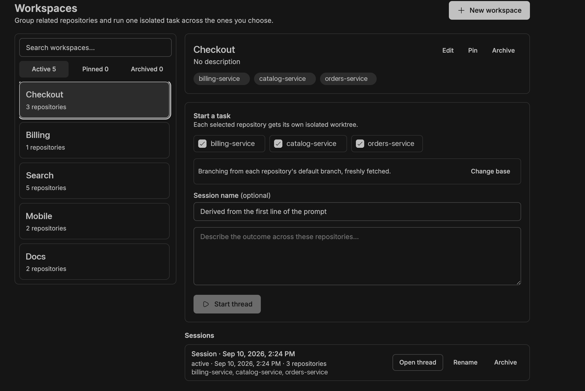
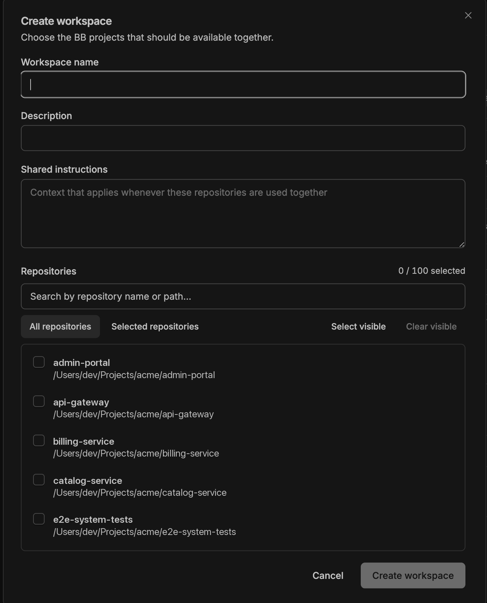
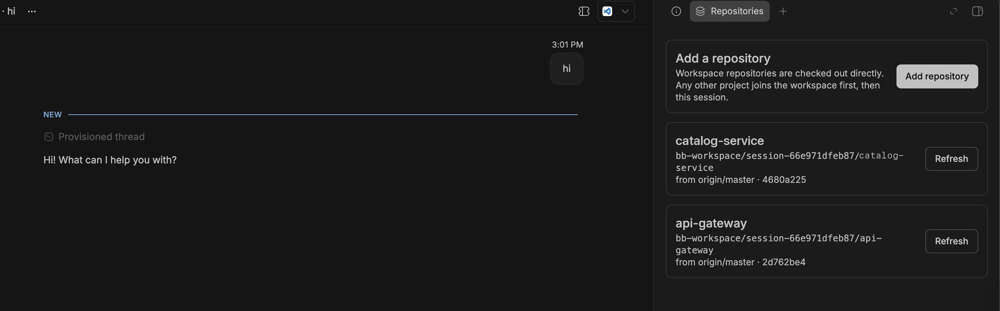

# BB Workspaces

BB Workspaces groups existing BB projects and launches one agent thread across an isolated checkout of each selected repository.



The plugin follows a simple model:

- A **workspace** is a reusable, many-to-many grouping of BB projects. It does not modify or replace those projects.
- A **session** keeps its initial selection as immutable historical context, while its active repository scope can expand append-only.
- Every selected repository gets its own Git worktree under one session root.
- New workspace threads are owned by the neutral `Workspace Hub` BB project; no real repository is primary. Thread titles use the workspace and session names, while BB's native icons provide the visual distinction. The thread's unmanaged working directory is the common session root.
- Repository branches survive cleanup. Worktrees are removed only after the session is archived, every working tree is clean, and each checkout is still on its recorded session branch.

## Use it



Open **Workspaces** in BB's navigation, create a workspace, and select the existing BB projects that belong together. The picker searches hundreds of projects by name or path, filters to selected projects, and supports selecting or clearing visible results while enforcing the 100-repository workspace limit. The workspace navigator searches names, descriptions, and repository aliases; filters active, pinned, and archived workspaces; and progressively renders 50 results at a time. To start a task:

1. Choose the repositories needed for this task. The first task selects all workspace repositories; later tasks remember the user's last subset. This is the session's initial selection and remains historical context even if the active scope later expands.
2. Optionally enter a session name, then enter the task prompt and select **Start thread**. Without an explicit name, the first non-empty prompt line becomes the session name. Session history shows the name, status, creation time, repository count, and aliases; **Rename** also updates the BB thread title when that thread still exists.

All selected projects must have a source on the same BB host. The new thread starts at a root shaped like:

```text
session root/
  AGENTS.md
  session.json
  repos/
    identity-service/
    api-gateway/
```



The thread's **Repositories** panel reports each checkout independently, including changed files and commits ahead of the session base. Its **Add repository** action offers the workspace repositories missing from this session, plus every other BB project checked out on the session's host. Picking a workspace repository expands the active session only (append-only). Picking any other project enrolls it in the saved workspace first — under the alias shown in the picker — and then checks it out here, so one action covers both.

Every worktree branches from the repository's own default branch (`origin/HEAD`, normally `origin/master`), fetched immediately before the branch is cut. Your source clone is never modified: no pull, no checkout, no stash — only remote-tracking refs are refreshed. Session start and the **Add repository** form both offer a per-repository **Branch from** selector to override that with your current checkout or any other ref; the chosen base is recorded per repository and shown in the Repositories panel. A fetch that fails or times out falls back to the last fetched commit rather than blocking the session.

Agent requests to add a repository default to approval. Choosing auto-approval applies only to that session and only to repositories that are current members of the saved workspace on the session's host; it never changes the workspace default or other sessions.

An initial selection can contain up to 20 repositories. An active session can accumulate up to 1,024 repositories (`MAX_SESSION_REPOSITORIES`); expansion checks this limit before provisioning, and cleanup accepts the same accumulated limit.

Expansion results distinguish ready, already completed by another request, cancelled, failed, and pending recovery. Pending requests retain their identity for retry. Approval and provisioning phases are durable: retry and ordinary session reads inspect the manifest, revalidate current eligibility, and resume approved work with the same operation key. An interrupted approval requires fresh approval; changing the session policy never implicitly approves an earlier waiting request. Ordinary reads cancel abandoned waiting approvals so the agent can submit a new request. Legacy agent requests with no recorded phase also require fresh approval unless their matching completed manifest operation proves success.

Git History support for sessions with multiple repositories comes from a generic companion plugin enhancement. Ordinary single-repository threads retain their existing Git History behavior.

When work is complete, commit or otherwise resolve changes and archive the session. **Remove worktrees** performs a full preflight before deleting anything. Commits remain on the generated branches. If any checkout has uncommitted changes or was switched to another branch, cleanup stops and preserves the whole session for recovery.

## CLI

The CLI is intentionally read-only in the first release:

```bash
bb workspaces list [--json]
bb workspaces show <workspace-id> [--json]
bb workspaces sessions [--json]
```

Workspace creation and session lifecycle operations remain in the UI, where repository and host choices can be reviewed before mutation.

## Development

```bash
npm install
npm test
npm run typecheck
bb plugin build
bb plugin install . --yes
```

The implementation uses only the public BB Plugin SDK and includes a public-SDK boundary test. Host-local Git operations live in `host.ts`; plugin state and orchestration live in `server.ts`; UI surfaces live in `app.tsx`.

## Safety and recovery

- The plugin never changes a BB project's configured source.
- Session directories are plugin-owned and collision checked.
- Worktree paths and manifests are validated before cleanup.
- Cleanup never uses `--force` and never deletes the generated branches.
- Launches have an idempotency key, preventing UI retries from creating duplicate threads.
- BB requires a project owner for every thread, so the plugin uses the neutral `Workspace Hub` owner and keeps that implementation detail out of the UI. Real repositories remain peers rather than a primary repository.
- If thread creation fails after checkout preparation, the failed session remains visible with its worktrees intact.
